**Defining the Question**

The goal is to identify which individuals are most likely to click on
ads displayed in a blog based on data that was previously collected on
the site. The prediction of such individuals will also be implemented
using supervised learning algorithms.

**Defining the Metrics for Success**

The project will be deemed successful when the individuals likely to
click ads will be identified and different supervised learning models
for prediction are created and their performance evaluated.

**Recording the Experimental Design**

1.  Reading in the data
2.  Checking for Missing Values
3.  Checking for Duplicates
4.  Checking for Outliers
5.  Exploratory Data Analysis
6.  Implementing Supervised Learning Algorithms
7.  Evaluating the Models Performance
8.  Conclusion and Recommendation

**Is the data appropriate to answer the question?**

Yes, the data is suitable for answering the question as the data was
collected on the site that will be used to host the cryptography online
class advertisement.

**Loading the required libraries**

``` r
# Loading libraries
library(readr)
library(ggplot2)
library(dplyr)
library(tibble)
library(stringr)
library(tidyr)
library(MASS)
library(lubridate)
library(InformationValue)
library(class)
library(e1071)
library(randomForest)
```

**Reading in the data**

``` r
# Reading the data
ads <- read_csv(file = 'C:/Users/Githu/Downloads/advertising.csv')
```

**Checking the Data**

``` r
# Determining the number of records
dim(ads)
```

    ## [1] 1000   10

``` r
# Displaying the structure of the dataset
str(ads)
```

    ## tibble [1,000 x 10] (S3: spec_tbl_df/tbl_df/tbl/data.frame)
    ##  $ Daily Time Spent on Site: num [1:1000] 69 80.2 69.5 74.2 68.4 ...
    ##  $ Age                     : num [1:1000] 35 31 26 29 35 23 33 48 30 20 ...
    ##  $ Area Income             : num [1:1000] 61834 68442 59786 54806 73890 ...
    ##  $ Daily Internet Usage    : num [1:1000] 256 194 236 246 226 ...
    ##  $ Ad Topic Line           : chr [1:1000] "Cloned 5thgeneration orchestration" "Monitored national standardization" "Organic bottom-line service-desk" "Triple-buffered reciprocal time-frame" ...
    ##  $ City                    : chr [1:1000] "Wrightburgh" "West Jodi" "Davidton" "West Terrifurt" ...
    ##  $ Male                    : num [1:1000] 0 1 0 1 0 1 0 1 1 1 ...
    ##  $ Country                 : chr [1:1000] "Tunisia" "Nauru" "San Marino" "Italy" ...
    ##  $ Timestamp               : POSIXct[1:1000], format: "2016-03-27 00:53:11" "2016-04-04 01:39:02" ...
    ##  $ Clicked on Ad           : num [1:1000] 0 0 0 0 0 0 0 1 0 0 ...
    ##  - attr(*, "spec")=
    ##   .. cols(
    ##   ..   `Daily Time Spent on Site` = col_double(),
    ##   ..   Age = col_double(),
    ##   ..   `Area Income` = col_double(),
    ##   ..   `Daily Internet Usage` = col_double(),
    ##   ..   `Ad Topic Line` = col_character(),
    ##   ..   City = col_character(),
    ##   ..   Male = col_double(),
    ##   ..   Country = col_character(),
    ##   ..   Timestamp = col_datetime(format = ""),
    ##   ..   `Clicked on Ad` = col_double()
    ##   .. )

``` r
# Viewing the top of our dataset
knitr::kable(
  ads[1:5, ]
  )
```

<table>
<colgroup>
<col style="width: 15%" />
<col style="width: 2%" />
<col style="width: 7%" />
<col style="width: 12%" />
<col style="width: 23%" />
<col style="width: 9%" />
<col style="width: 3%" />
<col style="width: 6%" />
<col style="width: 12%" />
<col style="width: 8%" />
</colgroup>
<thead>
<tr class="header">
<th style="text-align: right;">Daily Time Spent on Site</th>
<th style="text-align: right;">Age</th>
<th style="text-align: right;">Area Income</th>
<th style="text-align: right;">Daily Internet Usage</th>
<th style="text-align: left;">Ad Topic Line</th>
<th style="text-align: left;">City</th>
<th style="text-align: right;">Male</th>
<th style="text-align: left;">Country</th>
<th style="text-align: left;">Timestamp</th>
<th style="text-align: right;">Clicked on Ad</th>
</tr>
</thead>
<tbody>
<tr class="odd">
<td style="text-align: right;">68.95</td>
<td style="text-align: right;">35</td>
<td style="text-align: right;">61833.90</td>
<td style="text-align: right;">256.09</td>
<td style="text-align: left;">Cloned 5thgeneration orchestration</td>
<td style="text-align: left;">Wrightburgh</td>
<td style="text-align: right;">0</td>
<td style="text-align: left;">Tunisia</td>
<td style="text-align: left;">2016-03-27 00:53:11</td>
<td style="text-align: right;">0</td>
</tr>
<tr class="even">
<td style="text-align: right;">80.23</td>
<td style="text-align: right;">31</td>
<td style="text-align: right;">68441.85</td>
<td style="text-align: right;">193.77</td>
<td style="text-align: left;">Monitored national standardization</td>
<td style="text-align: left;">West Jodi</td>
<td style="text-align: right;">1</td>
<td style="text-align: left;">Nauru</td>
<td style="text-align: left;">2016-04-04 01:39:02</td>
<td style="text-align: right;">0</td>
</tr>
<tr class="odd">
<td style="text-align: right;">69.47</td>
<td style="text-align: right;">26</td>
<td style="text-align: right;">59785.94</td>
<td style="text-align: right;">236.50</td>
<td style="text-align: left;">Organic bottom-line service-desk</td>
<td style="text-align: left;">Davidton</td>
<td style="text-align: right;">0</td>
<td style="text-align: left;">San Marino</td>
<td style="text-align: left;">2016-03-13 20:35:42</td>
<td style="text-align: right;">0</td>
</tr>
<tr class="even">
<td style="text-align: right;">74.15</td>
<td style="text-align: right;">29</td>
<td style="text-align: right;">54806.18</td>
<td style="text-align: right;">245.89</td>
<td style="text-align: left;">Triple-buffered reciprocal time-frame</td>
<td style="text-align: left;">West Terrifurt</td>
<td style="text-align: right;">1</td>
<td style="text-align: left;">Italy</td>
<td style="text-align: left;">2016-01-10 02:31:19</td>
<td style="text-align: right;">0</td>
</tr>
<tr class="odd">
<td style="text-align: right;">68.37</td>
<td style="text-align: right;">35</td>
<td style="text-align: right;">73889.99</td>
<td style="text-align: right;">225.58</td>
<td style="text-align: left;">Robust logistical utilization</td>
<td style="text-align: left;">South Manuel</td>
<td style="text-align: right;">0</td>
<td style="text-align: left;">Iceland</td>
<td style="text-align: left;">2016-06-03 03:36:18</td>
<td style="text-align: right;">0</td>
</tr>
</tbody>
</table>

``` r
# Viewing the bottom of our dataset
knitr::kable(
  ads[995:1000, ] 
  )
```

<table>
<colgroup>
<col style="width: 14%" />
<col style="width: 2%" />
<col style="width: 6%" />
<col style="width: 12%" />
<col style="width: 21%" />
<col style="width: 8%" />
<col style="width: 2%" />
<col style="width: 13%" />
<col style="width: 11%" />
<col style="width: 8%" />
</colgroup>
<thead>
<tr class="header">
<th style="text-align: right;">Daily Time Spent on Site</th>
<th style="text-align: right;">Age</th>
<th style="text-align: right;">Area Income</th>
<th style="text-align: right;">Daily Internet Usage</th>
<th style="text-align: left;">Ad Topic Line</th>
<th style="text-align: left;">City</th>
<th style="text-align: right;">Male</th>
<th style="text-align: left;">Country</th>
<th style="text-align: left;">Timestamp</th>
<th style="text-align: right;">Clicked on Ad</th>
</tr>
</thead>
<tbody>
<tr class="odd">
<td style="text-align: right;">43.70</td>
<td style="text-align: right;">28</td>
<td style="text-align: right;">63126.96</td>
<td style="text-align: right;">173.01</td>
<td style="text-align: left;">Front-line bifurcated ability</td>
<td style="text-align: left;">Nicholasland</td>
<td style="text-align: right;">0</td>
<td style="text-align: left;">Mayotte</td>
<td style="text-align: left;">2016-04-04 03:57:48</td>
<td style="text-align: right;">1</td>
</tr>
<tr class="even">
<td style="text-align: right;">72.97</td>
<td style="text-align: right;">30</td>
<td style="text-align: right;">71384.57</td>
<td style="text-align: right;">208.58</td>
<td style="text-align: left;">Fundamental modular algorithm</td>
<td style="text-align: left;">Duffystad</td>
<td style="text-align: right;">1</td>
<td style="text-align: left;">Lebanon</td>
<td style="text-align: left;">2016-02-11 21:49:00</td>
<td style="text-align: right;">1</td>
</tr>
<tr class="odd">
<td style="text-align: right;">51.30</td>
<td style="text-align: right;">45</td>
<td style="text-align: right;">67782.17</td>
<td style="text-align: right;">134.42</td>
<td style="text-align: left;">Grass-roots cohesive monitoring</td>
<td style="text-align: left;">New Darlene</td>
<td style="text-align: right;">1</td>
<td style="text-align: left;">Bosnia and Herzegovina</td>
<td style="text-align: left;">2016-04-22 02:07:01</td>
<td style="text-align: right;">1</td>
</tr>
<tr class="even">
<td style="text-align: right;">51.63</td>
<td style="text-align: right;">51</td>
<td style="text-align: right;">42415.72</td>
<td style="text-align: right;">120.37</td>
<td style="text-align: left;">Expanded intangible solution</td>
<td style="text-align: left;">South Jessica</td>
<td style="text-align: right;">1</td>
<td style="text-align: left;">Mongolia</td>
<td style="text-align: left;">2016-02-01 17:24:57</td>
<td style="text-align: right;">1</td>
</tr>
<tr class="odd">
<td style="text-align: right;">55.55</td>
<td style="text-align: right;">19</td>
<td style="text-align: right;">41920.79</td>
<td style="text-align: right;">187.95</td>
<td style="text-align: left;">Proactive bandwidth-monitored policy</td>
<td style="text-align: left;">West Steven</td>
<td style="text-align: right;">0</td>
<td style="text-align: left;">Guatemala</td>
<td style="text-align: left;">2016-03-24 02:35:54</td>
<td style="text-align: right;">0</td>
</tr>
<tr class="even">
<td style="text-align: right;">45.01</td>
<td style="text-align: right;">26</td>
<td style="text-align: right;">29875.80</td>
<td style="text-align: right;">178.35</td>
<td style="text-align: left;">Virtual 5thgeneration emulation</td>
<td style="text-align: left;">Ronniemouth</td>
<td style="text-align: right;">0</td>
<td style="text-align: left;">Brazil</td>
<td style="text-align: left;">2016-06-03 21:43:21</td>
<td style="text-align: right;">1</td>
</tr>
</tbody>
</table>

``` r
# Standardizing the column names
names(ads) <- str_replace_all(names(ads), c(" " = "_"))
names(ads) <- tolower(names(ads))
colnames(ads)
```

    ##  [1] "daily_time_spent_on_site" "age"                     
    ##  [3] "area_income"              "daily_internet_usage"    
    ##  [5] "ad_topic_line"            "city"                    
    ##  [7] "male"                     "country"                 
    ##  [9] "timestamp"                "clicked_on_ad"

``` r
# Checking for missing values
colSums(is.na(ads))
```

    ## daily_time_spent_on_site                      age              area_income 
    ##                        0                        0                        0 
    ##     daily_internet_usage            ad_topic_line                     city 
    ##                        0                        0                        0 
    ##                     male                  country                timestamp 
    ##                        0                        0                        0 
    ##            clicked_on_ad 
    ##                        0

``` r
# Checking for duplicates
duplicated_rows <- ads[duplicated(ads),]
duplicated_rows
```

    ## # A tibble: 0 x 10
    ## # ... with 10 variables: daily_time_spent_on_site <dbl>, age <dbl>,
    ## #   area_income <dbl>, daily_internet_usage <dbl>, ad_topic_line <chr>,
    ## #   city <chr>, male <dbl>, country <chr>, timestamp <dttm>,
    ## #   clicked_on_ad <dbl>

``` r
# Checking for outliers using a boxplot
ads %>% 
  dplyr::select(daily_time_spent_on_site, daily_internet_usage, age, male) %>%
  tidyr::pivot_longer(., cols = c(daily_time_spent_on_site,daily_internet_usage,age),names_to = "Var", values_to = "Val") %>%
  ggplot(aes(x = Var, y = Val, fill = male)) +
  ggtitle("Boxplot of numerical columns") +
  geom_boxplot()
```


``` r
# Boxplot of the area_income variable
boxplot(ads$area_income)
```

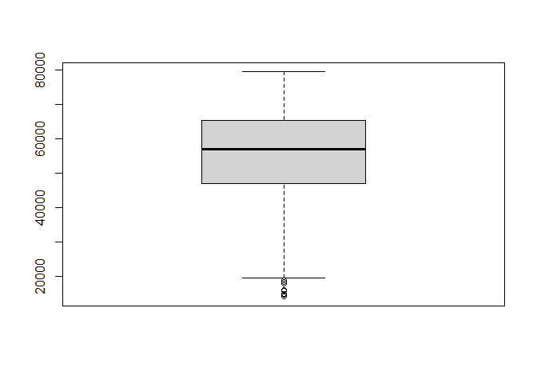

The dataset requires little cleaning. There are no missing values or
duplicates. The columns names have been standardised to have the same
format. Outliers are present in the area income variable only. These are
the entries of individuals with low income. We will work with these
outliers as dropping them means such individuals with lower
incomes(actual potential customers) will not be accounted for.

**Univariate Exploratory Data Analysis**

``` r
# Determining the average age of the visitors
average_age <- mean(ads$age)
paste("The average age of the visitors is", average_age)
```

    ## [1] "The average age of the visitors is 36.009"

``` r
# Determining the average income of the visitors
average_income <- mean(ads$area_income)
paste("The average area income of the visitors is:", average_income)
```

    ## [1] "The average area income of the visitors is: 55000.00008"

``` r
# Determining the average daily time spent on the site
average_time <- mean(ads$daily_time_spent_on_site)
paste("The average daily time spent on the site is:", average_time)
```

    ## [1] "The average daily time spent on the site is: 65.0002"

``` r
# Determining the average daily internet usage
average_usage <- mean(ads$daily_internet_usage)
paste("The average daily internet usage is:", average_usage)
```

    ## [1] "The average daily internet usage is: 180.0001"

``` r
# Determining the frequency count of male column
# 0 is female and 1 is male
table(ads$male)
```

    ## 
    ##   0   1 
    ## 519 481

``` r
# Determining the frequency count of the clicked_ad column
# 0 = did not click ad  and 1 = clicked ad
table(ads$clicked_on_ad)
```

    ## 
    ##   0   1 
    ## 500 500

``` r
# Summary statistics of the dataset
summary(ads)
```

    ##  daily_time_spent_on_site      age         area_income    daily_internet_usage
    ##  Min.   :32.60            Min.   :19.00   Min.   :13996   Min.   :104.8       
    ##  1st Qu.:51.36            1st Qu.:29.00   1st Qu.:47032   1st Qu.:138.8       
    ##  Median :68.22            Median :35.00   Median :57012   Median :183.1       
    ##  Mean   :65.00            Mean   :36.01   Mean   :55000   Mean   :180.0       
    ##  3rd Qu.:78.55            3rd Qu.:42.00   3rd Qu.:65471   3rd Qu.:218.8       
    ##  Max.   :91.43            Max.   :61.00   Max.   :79485   Max.   :270.0       
    ##  ad_topic_line          city                male         country         
    ##  Length:1000        Length:1000        Min.   :0.000   Length:1000       
    ##  Class :character   Class :character   1st Qu.:0.000   Class :character  
    ##  Mode  :character   Mode  :character   Median :0.000   Mode  :character  
    ##                                        Mean   :0.481                     
    ##                                        3rd Qu.:1.000                     
    ##                                        Max.   :1.000                     
    ##    timestamp                   clicked_on_ad
    ##  Min.   :2016-01-01 02:52:10   Min.   :0.0  
    ##  1st Qu.:2016-02-18 02:55:42   1st Qu.:0.0  
    ##  Median :2016-04-07 17:27:29   Median :0.5  
    ##  Mean   :2016-04-10 10:34:06   Mean   :0.5  
    ##  3rd Qu.:2016-05-31 03:18:14   3rd Qu.:1.0  
    ##  Max.   :2016-07-24 00:22:16   Max.   :1.0

**Bivariate Exploratory Data Analysis**

``` r
# Bar plot of gender and age
ggplot(data=ads, aes(x=male, y=age)) +
  geom_bar(stat="identity", width=0.5) +
  ggtitle("Barplot of age based on gender")
```

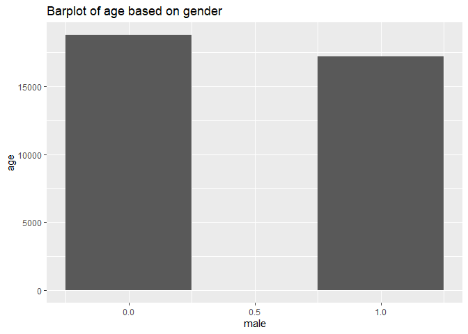

``` r
# Selecting the numerical columns
num_cols <- ads[,c(1, 2, 3, 4)]
colnames(num_cols)
```

    ## [1] "daily_time_spent_on_site" "age"                     
    ## [3] "area_income"              "daily_internet_usage"

``` r
# Correlation matrix of the continuous data
cor(num_cols)
```

    ##                          daily_time_spent_on_site        age area_income
    ## daily_time_spent_on_site                1.0000000 -0.3315133   0.3109544
    ## age                                    -0.3315133  1.0000000  -0.1826050
    ## area_income                             0.3109544 -0.1826050   1.0000000
    ## daily_internet_usage                    0.5186585 -0.3672086   0.3374955
    ##                          daily_internet_usage
    ## daily_time_spent_on_site            0.5186585
    ## age                                -0.3672086
    ## area_income                         0.3374955
    ## daily_internet_usage                1.0000000

``` r
# Distribution of area income
hist(ads[ads$clicked_on_ad == 1,]$area_income,xlab = 'Area Income', main = 'Clicked on ads' )
```

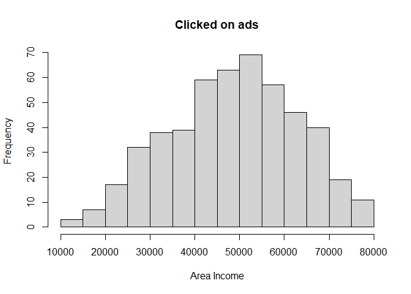

``` r
hist(ads[ads$clicked_on_ad == 0,]$area_income,xlab = 'Area Income', main = 'Did not click ads' )
```

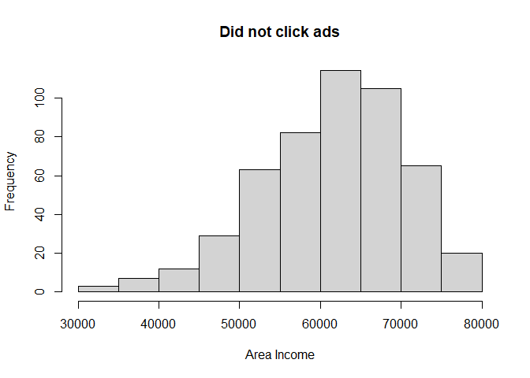

``` r
# Average Income of users based on whether they clicked the ads or not
ads %>%
  group_by(clicked_on_ad) %>%
  summarise(mean(area_income))
```

    ## # A tibble: 2 x 2
    ##   clicked_on_ad `mean(area_income)`
    ##           <dbl>               <dbl>
    ## 1             0              61386.
    ## 2             1              48614.

``` r
# Finding the age group that most clicks on ads using a histogram
ads %>%
  filter(clicked_on_ad == 1) %>%
  ggplot(aes(x=age)) +
  geom_histogram(binwidth = 10, fill="#69b3a2", color="#e9ecef", alpha=0.9) +
  ggtitle("Age Distribution of the users that clicked the ad") 
```

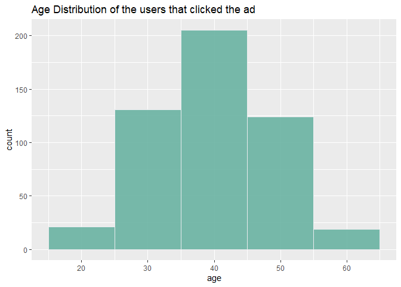

The age group that most clicked on the ads ranges between 35 and 45

``` r
# Finding the age group that did not click on the ads using a histogram
ads %>%
  filter(clicked_on_ad == 0) %>%
  ggplot(aes(x=age)) +
  geom_histogram(binwidth = 10, fill="#69b3a2", color="#e9ecef", alpha=0.9) +
  ggtitle("Age Distribution of the users that did not click the ad")
```

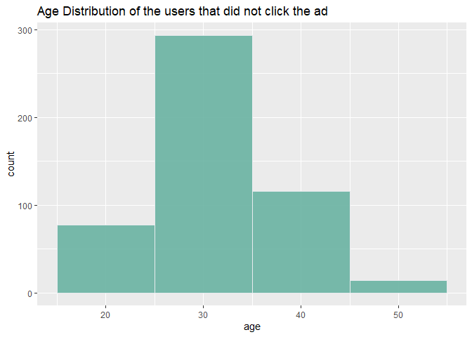

Most users who did not click on the ads are between the age of 25 and 35

``` r
# Distribution of daily time spent on site
ads %>%
  filter(clicked_on_ad == 1) %>%
  ggplot(aes(x=daily_time_spent_on_site)) +
  geom_histogram(binwidth = 10, fill="#69b3a2", color="#e9ecef", alpha=0.9) +
  ggtitle("Distribution of daily time spent on site") 
```

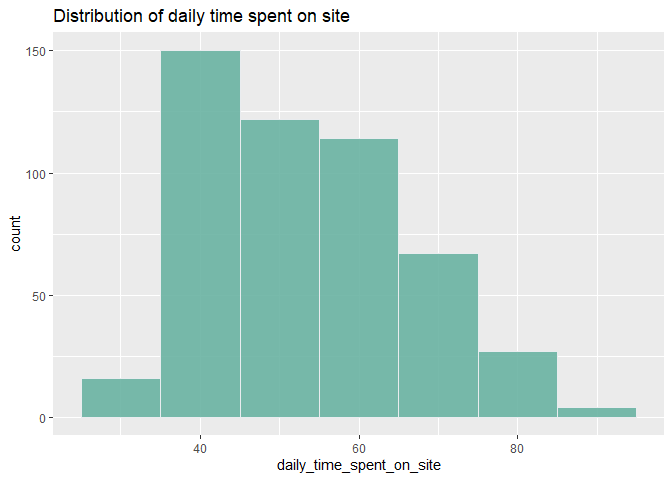

Most of the users who clicked on the ads spent 30 to 50 minutes on the
site daily

``` r
# Histogram of daily internet usage
ads %>%
  filter(clicked_on_ad == 1) %>%
  ggplot(aes(x=daily_internet_usage)) +
  geom_histogram(binwidth = 10, fill="#69b3a2", color="#e9ecef", alpha=0.9) +
  ggtitle("Histogram of daily internet usage")
```

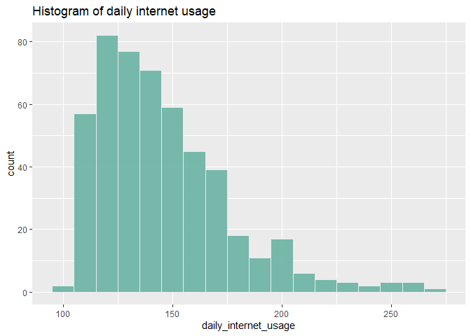

Most users who clicked on the ads spent 120 to 150 minutes daily on the
internet

``` r
# Exploring the timestamp summary
# Plotting the months (clicked_ads = 1)
ads %>%
  filter(clicked_on_ad == 1) %>%
  mutate(ads_months = month(timestamp, label = TRUE)) %>%
  ggplot(aes(x=ads_months)) +
  ggtitle("Months") +
  geom_bar()
```

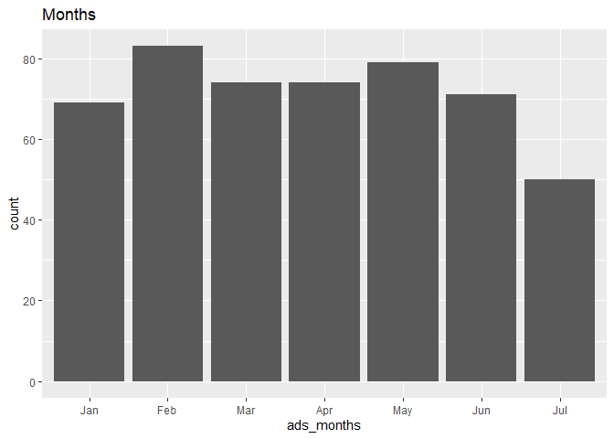

The month of February recorded the highest number of the clicked ads

``` r
# Plotting the weekdays (clicked_ads = 1)
ads %>%
  filter(clicked_on_ad == 1) %>%
  mutate(ads_weekdays = wday(timestamp, label = TRUE)) %>%
  ggplot(aes(x=ads_weekdays)) +
  ggtitle("Weekdays") +
  geom_bar()
```

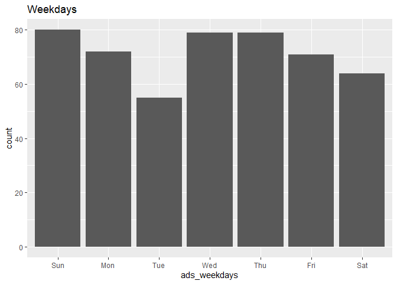

Most ads were clicked on Sunday, Wednesday or Thursday

``` r
# Exploring the time concept 
# Plotting the hour componenr (clicked_ads = 1)
ads %>%
  filter(clicked_on_ad == 1) %>%
  mutate(ads_hours = hour(timestamp)) %>%
  group_by(ads_hours) %>%
  ggplot(aes(x=ads_hours)) +
  ggtitle("Hour") +
  geom_bar()
```

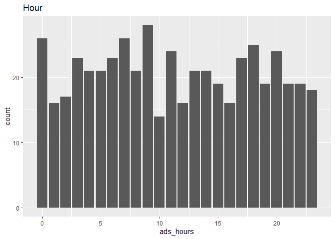

The highest number of clicked ads were recorded between 9th hour and the
lowest at the 10th hour

``` r
# Countries 
ads %>%
  dplyr::select(country, clicked_on_ad) %>%
  filter(clicked_on_ad == 1) %>%
  group_by(country) %>%
  summarise(n=n()) %>%
  arrange(desc(n))
```

    ## # A tibble: 215 x 2
    ##    country           n
    ##    <chr>         <int>
    ##  1 Australia         7
    ##  2 Ethiopia          7
    ##  3 Turkey            7
    ##  4 Liberia           6
    ##  5 Liechtenstein     6
    ##  6 South Africa      6
    ##  7 Afghanistan       5
    ##  8 France            5
    ##  9 Hungary           5
    ## 10 Mayotte           5
    ## # ... with 205 more rows

``` r
ads %>%
  dplyr::select(city, clicked_on_ad, country) %>%
  filter(clicked_on_ad == 1) %>%
  group_by(city) %>%
  summarise(n=n()) %>%
  arrange(desc(n))
```

    ## # A tibble: 490 x 2
    ##    city             n
    ##    <chr>        <int>
    ##  1 Lake David       2
    ##  2 Lake James       2
    ##  3 Lisamouth        2
    ##  4 Michelleside     2
    ##  5 Millerbury       2
    ##  6 Robertfurt       2
    ##  7 South Lisa       2
    ##  8 West Amanda      2
    ##  9 West Shannon     2
    ## 10 Williamsport     2
    ## # ... with 480 more rows

The countries with relatively higher number of users that clicked the
ads include: Australia, Ethiopia, Turkey, Liberia, Liechenstein, South
Africa, Afghanistan, France, Hungary and Mayotte.

The characteristics of the blog’s users that are likely to click on the
ads include:

1.  The user is female
2.  Ages between 35 and 45 years
3.  Has an income ranging from 40,000 to 60,000
4.  Spends 30 to 50 minutes daily on the site
5.  Spends 120 to 150 minutes daily on the internet
6.  Visits the blog either on a Sunday, Wednesday or Thursday
7.  Visits the blog in early morning hours
8.  Their country location is among the following countries:Australia,
    Ethiopia, Turkey, Liberia, Liechtenstein, South Africa, Afghanistan,
    France, Hungary and Mayotte.

**Implementing the Supervised Learning Algorithms**

**a) A Binomial Logistic Regression Model**

``` r
# Implementing a binomial logistic regression model
# Dropping the variables that will not be used in the modeling
df <- ads[-c(5:6,8:9)]
colnames(df)
```

    ## [1] "daily_time_spent_on_site" "age"                     
    ## [3] "area_income"              "daily_internet_usage"    
    ## [5] "male"                     "clicked_on_ad"

``` r
# Splitting into train and test sets
train <- df[1:800,]
test <- df[801:1000,]

# Fitting the model
logit_model <- glm(formula = clicked_on_ad ~ . , family = "binomial", data = train)

# Viewing the results of our model
summary(logit_model)
```

    ## 
    ## Call:
    ## glm(formula = clicked_on_ad ~ ., family = "binomial", data = train)
    ## 
    ## Deviance Residuals: 
    ##     Min       1Q   Median       3Q      Max  
    ## -2.5593  -0.1084  -0.0478   0.0118   3.2686  
    ## 
    ## Coefficients:
    ##                            Estimate Std. Error z value Pr(>|z|)    
    ## (Intercept)               3.156e+01  3.637e+00   8.676  < 2e-16 ***
    ## daily_time_spent_on_site -2.138e-01  2.632e-02  -8.122 4.60e-16 ***
    ## age                       1.648e-01  2.951e-02   5.585 2.33e-08 ***
    ## area_income              -1.572e-04  2.329e-05  -6.749 1.49e-11 ***
    ## daily_internet_usage     -7.027e-02  8.495e-03  -8.272  < 2e-16 ***
    ## male                     -6.847e-01  4.797e-01  -1.427    0.153    
    ## ---
    ## Signif. codes:  0 '***' 0.001 '**' 0.01 '*' 0.05 '.' 0.1 ' ' 1
    ## 
    ## (Dispersion parameter for binomial family taken to be 1)
    ## 
    ##     Null deviance: 1108.3  on 799  degrees of freedom
    ## Residual deviance:  129.4  on 794  degrees of freedom
    ## AIC: 141.4
    ## 
    ## Number of Fisher Scoring iterations: 8

The deviance residuals are a measure of model fit. The next part shows
the coefficients, their standard errors, z-statistic and associated
p-values. The logistic regression coefficients give the change in the
log odds of the outcome for a one unit increase in the predictor
variable. The difference between null deviance and residual deviance
tells us that the model is a good fit. The greater the difference the
better the model.

``` r
# Assessing the predictive ability of our model
# logit_results <- predict(logit_model, newdata = test, type = 'response')
# Using the InformationValue package functions 
predicted <- plogis(predict(logit_model, test))
optCutOff <- optimalCutoff(test$clicked_on_ad, predicted)[1] 

# Getting the misclassification error 
misClassError(test$clicked_on_ad, predicted, threshold = optCutOff)
```

    ## [1] 0.04

``` r
# Plotting ROC
plotROC(test$clicked_on_ad, predicted)
```

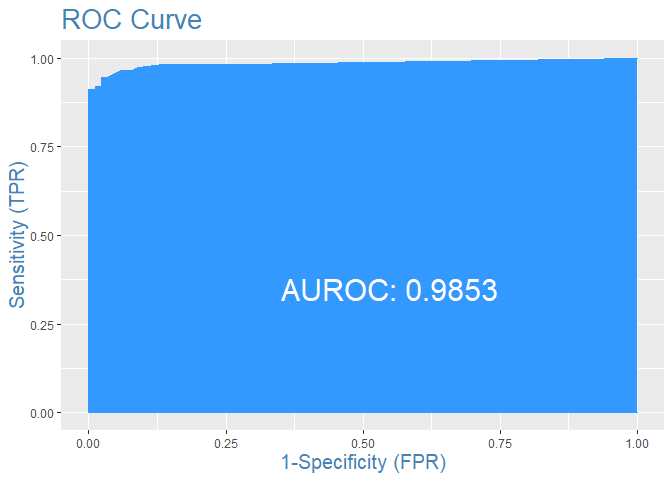

This Receiver Operating Characteristic curve shows the model performance
at all classification thresholds. It’s a plot of the true positive rate
vs. the true negative rate and gives the Area Under the Curve score of
98% indicating that the model performed well in the test data.

``` r
# Determining the concordance
Concordance(test$clicked_on_ad, predicted)
```

    ## $Concordance
    ## [1] 0.9849838
    ## 
    ## $Discordance
    ## [1] 0.01501623
    ## 
    ## $Tied
    ## [1] -3.295975e-17
    ## 
    ## $Pairs
    ## [1] 9856

``` r
# Displaying the Confusion Matrix
confusionMatrix(test$clicked_on_ad, predicted, threshold = optCutOff)
```

    ##    0   1
    ## 0 85   5
    ## 1  3 107

``` r
# Calculating the specificity and sensitivity
# Sensitivity is the true positive rate a.k.a recall
# Specificity is the true negative rate
sensitivity(test$clicked_on_ad, predicted, threshold = optCutOff)
```

    ## [1] 0.9553571

``` r
specificity(test$clicked_on_ad, predicted, threshold = optCutOff)
```

    ## [1] 0.9659091

``` r
# Calculating accuracy from confusion matrix manually
# accuracy = TP+TN/TP+FP+TN+FN
accuracy <- 212/220
accuracy
```

    ## [1] 0.9636364

The binomial logistic model has an accuracy of around 0.96. The
sensitivity is the true positive rate also known as recall while
specificity is the true negative rate.

**b) A k-Nearest Neighbor Classifier**

``` r
# Creating a function for normalizing the data
norm_func <- function(x){
  x - min(x) / max(x) - min(x)
}

# Running the normalization on the predictors
df_norm <- as.data.frame(lapply(df,norm_func))
head(df_norm)
```

    ##   daily_time_spent_on_site       age area_income daily_internet_usage male
    ## 1                 35.99344 15.688525    47837.22            150.92187    0
    ## 2                 47.27344 11.688525    54445.17             88.60187    1
    ## 3                 36.51344  6.688525    45789.26            131.33187    0
    ## 4                 41.19344  9.688525    40809.50            140.72187    1
    ## 5                 35.41344 15.688525    59893.31            120.41187    0
    ## 6                 27.03344  3.688525    45764.88            121.57187    1
    ##   clicked_on_ad
    ## 1             0
    ## 2             0
    ## 3             0
    ## 4             0
    ## 5             0
    ## 6             0

``` r
# Splitting into train and test sets
train <- df_norm[1:800,]
test <- df_norm[801:1000,]

train_label <- df_norm[1:800, 6]
test_label <- df_norm[801:1000, 6]

dim(train)
```

    ## [1] 800   6

``` r
# Fitting the model and computing the confusion matrix
knn_model <- knn(train= train,test=test, cl= train_label, k=1)
table(factor(knn_model))
```

    ## 
    ##   0   1 
    ##  95 105

``` r
confusion_matrix_table <- table(test_label,knn_model)
confusion_matrix_table
```

    ##           knn_model
    ## test_label  0  1
    ##          0 69 19
    ##          1 26 86

``` r
# Calculating the accuracy
accuracy <- function(x){sum(diag(x)/(sum(rowSums(x)))) * 100}
accuracy(confusion_matrix_table)
```

    ## [1] 77.5

``` r
# Improving the model by investigating the optimal number of k
# Initializing loop
i=1                          
k_optm=1                     
for (i in 1:20){ 
    knn_model <-  knn(train= train,test=test, cl= train_label, k=i)
    k_optm[i] <- 100 * sum(test_label == knn_model)/NROW(test_label)
    k=i  
    cat(k,'=',k_optm[i],'\n')       
}
```

    ## 1 = 77.5 
    ## 2 = 69.5 
    ## 3 = 72.5 
    ## 4 = 71 
    ## 5 = 69 
    ## 6 = 68.5 
    ## 7 = 68.5 
    ## 8 = 68 
    ## 9 = 69.5 
    ## 10 = 71 
    ## 11 = 67 
    ## 12 = 69 
    ## 13 = 72 
    ## 14 = 70.5 
    ## 15 = 71.5 
    ## 16 = 69 
    ## 17 = 69 
    ## 18 = 73.5 
    ## 19 = 69.5 
    ## 20 = 70

``` r
# Maximum accuracy at k=1
plot(k_optm, type="b", xlab="K- Value",ylab="Accuracy level")
```

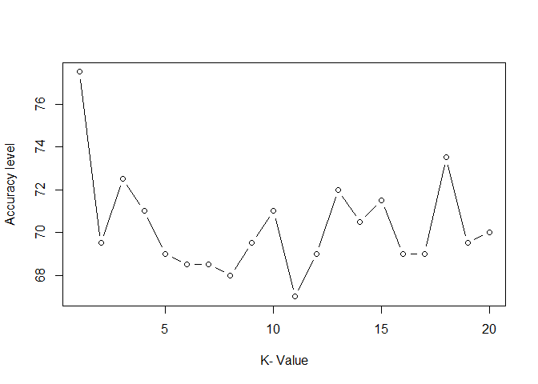

The best accuracy (78%) for the KNN classifier is obtained when the
number of neighbors is 1. This is because our target variable has two
outcomes i.e. whether the individual clicked the ad or not.

**c) Support Vector Machine Classifier**

``` r
# Running the normalization on the predictors
df_norm <- as.data.frame(lapply(df,norm_func))
head(df_norm)
```

    ##   daily_time_spent_on_site       age area_income daily_internet_usage male
    ## 1                 35.99344 15.688525    47837.22            150.92187    0
    ## 2                 47.27344 11.688525    54445.17             88.60187    1
    ## 3                 36.51344  6.688525    45789.26            131.33187    0
    ## 4                 41.19344  9.688525    40809.50            140.72187    1
    ## 5                 35.41344 15.688525    59893.31            120.41187    0
    ## 6                 27.03344  3.688525    45764.88            121.57187    1
    ##   clicked_on_ad
    ## 1             0
    ## 2             0
    ## 3             0
    ## 4             0
    ## 5             0
    ## 6             0

``` r
# Splitting into train and test sets
train <- df_norm[1:800,]
test <- df_norm[801:1000,]

# Fitting SVM to the training set
classifier = svm(formula = clicked_on_ad ~ ., 
                 data = train, 
                 type = 'C-classification', 
                 kernel = 'linear') 

classifier
```

    ## 
    ## Call:
    ## svm(formula = clicked_on_ad ~ ., data = train, type = "C-classification", 
    ##     kernel = "linear")
    ## 
    ## 
    ## Parameters:
    ##    SVM-Type:  C-classification 
    ##  SVM-Kernel:  linear 
    ##        cost:  1 
    ## 
    ## Number of Support Vectors:  67

``` r
# Running the prediction on the test set
svm_predicted <- predict(classifier, newdata = test[-6])

# Viewing the confusion matrix
confusion_matrix_table <- table(test$clicked_on_ad, svm_predicted) 
confusion_matrix_table
```

    ##    svm_predicted
    ##       0   1
    ##   0  86   2
    ##   1   6 106

``` r
# Calculating the accuracy
accuracy <- function(x){sum(diag(x)/(sum(rowSums(x)))) * 100}
accuracy(confusion_matrix_table)
```

    ## [1] 96

``` r
# Fitting with radial basis function parameter
classifier = svm(formula = clicked_on_ad ~ ., 
                 data = train, 
                 type = 'C-classification', 
                 kernel = 'radial') 

# Running the prediction on the test set
svm_predicted <- predict(classifier, newdata = test[-6])

# Viewing the confusion matrix
confusion_matrix_table <- table(test$clicked_on_ad, svm_predicted)

# The accuracy score
accuracy(confusion_matrix_table)
```

    ## [1] 95.5

The accuracy of the SVM classifier slightly drops when the kernel is
changed from linear to radial basis function.

**d) Random Forest Classifier**

``` r
# RF Classifier
# Converting the categorical variables to factor type
df$clicked_on_ad <- factor(df$clicked_on_ad)
df$male <- factor(df$male)
summary(df)
```

    ##  daily_time_spent_on_site      age         area_income    daily_internet_usage
    ##  Min.   :32.60            Min.   :19.00   Min.   :13996   Min.   :104.8       
    ##  1st Qu.:51.36            1st Qu.:29.00   1st Qu.:47032   1st Qu.:138.8       
    ##  Median :68.22            Median :35.00   Median :57012   Median :183.1       
    ##  Mean   :65.00            Mean   :36.01   Mean   :55000   Mean   :180.0       
    ##  3rd Qu.:78.55            3rd Qu.:42.00   3rd Qu.:65471   3rd Qu.:218.8       
    ##  Max.   :91.43            Max.   :61.00   Max.   :79485   Max.   :270.0       
    ##  male    clicked_on_ad
    ##  0:519   0:500        
    ##  1:481   1:500        
    ##                       
    ##                       
    ##                       
    ## 

``` r
# Splitting into train and test sets
train <- df[1:800,]
test <- df[801:1000,]

# Initializing the random forest class instance
rf_model <- randomForest(
  clicked_on_ad ~ .,
  data = train,
  importance = TRUE
)
rf_model
```

    ## 
    ## Call:
    ##  randomForest(formula = clicked_on_ad ~ ., data = train, importance = TRUE) 
    ##                Type of random forest: classification
    ##                      Number of trees: 500
    ## No. of variables tried at each split: 2
    ## 
    ##         OOB estimate of  error rate: 3.88%
    ## Confusion matrix:
    ##     0   1 class.error
    ## 0 397  15  0.03640777
    ## 1  16 372  0.04123711

``` r
# Running the prediction on the test set
rf_predicted <- predict(rf_model, newdata = test[-6])

# Getting the confusion matrix
confusion_matrix_table <- table(test$clicked_on_ad, rf_predicted)

# The accuracy score
accuracy(confusion_matrix_table)
```

    ## [1] 96

The accuracy score for our random forest classifier with 500 trees is
96% which is pretty decent and no further tuning is required.

**Conclusion and Recommendation**

In this exercise we trained and fitted 4 different models to predict the
outcome of whether an individual would click an ad or not. The models
generally had a good performance with an accuracy score of 96% except
the KNN which had a lower value of 78%. Further tuning could be
conducted on the models and implemented on a validation set to test
their generalizability. Other classifiers that were not implemented here
can be be fitted on the dataset and their performance evaluated.
