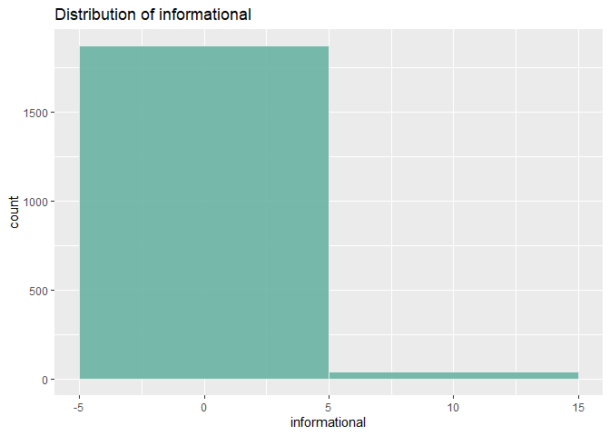

**Defining the Problem**

The goal is to learn the characteristics of customer groups and
customer’s behavior from data collected by a Russian brand (Kira
Plastinina which is a brand of fashionable designer clothes). The
insights will primarily be drawn from exploratory data analysis and
clustering.

**Defining the Metrics for Success**

1.  Performing clustering
2.  Compare the approaches used

**Recording the Experimental Design **

1.  Problem Definition
2.  Data Sourcing
3.  Checking the Data
4.  Performing Data Cleaning
5.  Performing Exploratory Data Analysis(Univariate, Bivariate and
    Multivariate)
6.  Implementing the Solution
7.  Challenging the Solution
8.  Follow up Questions

**Is the data appropriate to answer the question? **

Kira Plastinina runs an online store where customers shop, pay and ship
their order. The data provided contains information about the visitors
to their e-commerce site for example the different types of pages
visited in a session. Yes, the data will definitely help in
understanding the customer’s characteristics.

**Loading the Libraries**

``` r
# Loading the required libraries
library(readr)
library(tidyr)
library(stringr)
library(dplyr)
library(ggplot2)
library(plotly)
library(caret)
library(dbscan)
```

**Reading in the data**

``` r
shoppers <- read_csv(file = "C:/Users/Githu/Downloads/online_shoppers_intention.csv")
```

**Checking the data**

``` r
# Determining the number of records
dim(shoppers)
```

    ## [1] 12330    18

``` r
# Viewing the structure of the data
str(shoppers)
```

    ## tibble [12,330 x 18] (S3: spec_tbl_df/tbl_df/tbl/data.frame)
    ##  $ Administrative         : num [1:12330] 0 0 0 0 0 0 0 1 0 0 ...
    ##  $ Administrative_Duration: num [1:12330] 0 0 -1 0 0 0 -1 -1 0 0 ...
    ##  $ Informational          : num [1:12330] 0 0 0 0 0 0 0 0 0 0 ...
    ##  $ Informational_Duration : num [1:12330] 0 0 -1 0 0 0 -1 -1 0 0 ...
    ##  $ ProductRelated         : num [1:12330] 1 2 1 2 10 19 1 1 2 3 ...
    ##  $ ProductRelated_Duration: num [1:12330] 0 64 -1 2.67 627.5 ...
    ##  $ BounceRates            : num [1:12330] 0.2 0 0.2 0.05 0.02 ...
    ##  $ ExitRates              : num [1:12330] 0.2 0.1 0.2 0.14 0.05 ...
    ##  $ PageValues             : num [1:12330] 0 0 0 0 0 0 0 0 0 0 ...
    ##  $ SpecialDay             : num [1:12330] 0 0 0 0 0 0 0.4 0 0.8 0.4 ...
    ##  $ Month                  : chr [1:12330] "Feb" "Feb" "Feb" "Feb" ...
    ##  $ OperatingSystems       : num [1:12330] 1 2 4 3 3 2 2 1 2 2 ...
    ##  $ Browser                : num [1:12330] 1 2 1 2 3 2 4 2 2 4 ...
    ##  $ Region                 : num [1:12330] 1 1 9 2 1 1 3 1 2 1 ...
    ##  $ TrafficType            : num [1:12330] 1 2 3 4 4 3 3 5 3 2 ...
    ##  $ VisitorType            : chr [1:12330] "Returning_Visitor" "Returning_Visitor" "Returning_Visitor" "Returning_Visitor" ...
    ##  $ Weekend                : logi [1:12330] FALSE FALSE FALSE FALSE TRUE FALSE ...
    ##  $ Revenue                : logi [1:12330] FALSE FALSE FALSE FALSE FALSE FALSE ...
    ##  - attr(*, "spec")=
    ##   .. cols(
    ##   ..   Administrative = col_double(),
    ##   ..   Administrative_Duration = col_double(),
    ##   ..   Informational = col_double(),
    ##   ..   Informational_Duration = col_double(),
    ##   ..   ProductRelated = col_double(),
    ##   ..   ProductRelated_Duration = col_double(),
    ##   ..   BounceRates = col_double(),
    ##   ..   ExitRates = col_double(),
    ##   ..   PageValues = col_double(),
    ##   ..   SpecialDay = col_double(),
    ##   ..   Month = col_character(),
    ##   ..   OperatingSystems = col_double(),
    ##   ..   Browser = col_double(),
    ##   ..   Region = col_double(),
    ##   ..   TrafficType = col_double(),
    ##   ..   VisitorType = col_character(),
    ##   ..   Weekend = col_logical(),
    ##   ..   Revenue = col_logical()
    ##   .. )

``` r
# Viewing the top of our data
head(shoppers)
```

    ## # A tibble: 6 x 18
    ##   Administrative Administrative_~ Informational Informational_D~ ProductRelated
    ##            <dbl>            <dbl>         <dbl>            <dbl>          <dbl>
    ## 1              0                0             0                0              1
    ## 2              0                0             0                0              2
    ## 3              0               -1             0               -1              1
    ## 4              0                0             0                0              2
    ## 5              0                0             0                0             10
    ## 6              0                0             0                0             19
    ## # ... with 13 more variables: ProductRelated_Duration <dbl>, BounceRates <dbl>,
    ## #   ExitRates <dbl>, PageValues <dbl>, SpecialDay <dbl>, Month <chr>,
    ## #   OperatingSystems <dbl>, Browser <dbl>, Region <dbl>, TrafficType <dbl>,
    ## #   VisitorType <chr>, Weekend <lgl>, Revenue <lgl>

``` r
# Viewing the bottom of our data
tail(shoppers)
```

    ## # A tibble: 6 x 18
    ##   Administrative Administrative_~ Informational Informational_D~ ProductRelated
    ##            <dbl>            <dbl>         <dbl>            <dbl>          <dbl>
    ## 1              0                0             1                0             16
    ## 2              3              145             0                0             53
    ## 3              0                0             0                0              5
    ## 4              0                0             0                0              6
    ## 5              4               75             0                0             15
    ## 6              0                0             0                0              3
    ## # ... with 13 more variables: ProductRelated_Duration <dbl>, BounceRates <dbl>,
    ## #   ExitRates <dbl>, PageValues <dbl>, SpecialDay <dbl>, Month <chr>,
    ## #   OperatingSystems <dbl>, Browser <dbl>, Region <dbl>, TrafficType <dbl>,
    ## #   VisitorType <chr>, Weekend <lgl>, Revenue <lgl>

**Data Cleaning**

``` r
# Standardizing column names to lower case
colnames(shoppers) <- tolower(colnames(shoppers))

# Checking and Dealing with missing values
colSums(is.na(shoppers))
```

    ##          administrative administrative_duration           informational 
    ##                      14                      14                      14 
    ##  informational_duration          productrelated productrelated_duration 
    ##                      14                      14                      14 
    ##             bouncerates               exitrates              pagevalues 
    ##                      14                      14                       0 
    ##              specialday                   month        operatingsystems 
    ##                       0                       0                       0 
    ##                 browser                  region             traffictype 
    ##                       0                       0                       0 
    ##             visitortype                 weekend                 revenue 
    ##                       0                       0                       0

There are missing values in some of the columns and we can drop them as
they’re not many.

``` r
# Dropping the missing values
shoppers <- na.omit(shoppers)
colSums(is.na(shoppers))
```

    ##          administrative administrative_duration           informational 
    ##                       0                       0                       0 
    ##  informational_duration          productrelated productrelated_duration 
    ##                       0                       0                       0 
    ##             bouncerates               exitrates              pagevalues 
    ##                       0                       0                       0 
    ##              specialday                   month        operatingsystems 
    ##                       0                       0                       0 
    ##                 browser                  region             traffictype 
    ##                       0                       0                       0 
    ##             visitortype                 weekend                 revenue 
    ##                       0                       0                       0

``` r
# Checking for duplicates
duplicates <- shoppers[duplicated(shoppers),]
count(duplicates)
```

    ## # A tibble: 1 x 1
    ##       n
    ##   <int>
    ## 1   117

``` r
# Picking only the unique values of the data
shoppers <- unique(shoppers)
anyDuplicated(shoppers)
```

    ## [1] 0

``` r
# Checking for Outliers using a boxplot
numeric_columns <- shoppers[-c(11:18)]

par ( mfrow= c (  2, 5 ))
for (i in 1 : length (numeric_columns)) {
boxplot (numeric_columns[,i], main= names (numeric_columns[i]), type= "l" )
}
```


Most of the columns have outliers and we’re going to work with them as
removing them would greatly reduce the dimensions of the data.

**Exploratory Data Analysis**

``` r
# Frequency count of categorical variables
table(shoppers$month)
```

    ## 
    ##  Aug  Dec  Feb  Jul June  Mar  May  Nov  Oct  Sep 
    ##  433 1706  182  432  285 1853 3328 2983  549  448

``` r
table(shoppers$visitortype)
```

    ## 
    ##       New_Visitor             Other Returning_Visitor 
    ##              1693                81             10425

``` r
table(shoppers$weekend)
```

    ## 
    ## FALSE  TRUE 
    ##  9343  2856

``` r
table(shoppers$revenue)
```

    ## 
    ## FALSE  TRUE 
    ## 10291  1908

``` r
table(shoppers$operatingsystems)
```

    ## 
    ##    1    2    3    4    5    6    7    8 
    ## 2548 6536 2530  478    6   19    7   75

``` r
table(shoppers$browser)
```

    ## 
    ##    1    2    3    4    5    6    7    8    9   10   11   12   13 
    ## 2426 7878  105  730  466  174   49  135    1  163    6   10   56

``` r
table(shoppers$region)
```

    ## 
    ##    1    2    3    4    5    6    7    8    9 
    ## 4711 1127 2382 1168  317  800  758  431  505

``` r
table(shoppers$traffictype)
```

    ## 
    ##    1    2    3    4    5    6    7    8    9   10   11   12   13   14   15   16 
    ## 2383 3907 2017 1066  260  443   40  343   41  450  247    1  728   13   36    3 
    ##   17   18   19   20 
    ##    1   10   17  193

``` r
# Creating a function to compute the mode of the variables
getmode <- function(x) {
unique_x <- unique(x)
unique_x[which.max(tabulate(match(x, unique_x)))]
}

# Modal values of the columns
df2 <- as.data.frame(lapply(numeric_columns,getmode))
df2
```

    ##   administrative administrative_duration informational informational_duration
    ## 1              0                       0             0                      0
    ##   productrelated productrelated_duration bouncerates exitrates pagevalues
    ## 1              1                       0           0       0.2          0
    ##   specialday
    ## 1          0

``` r
# Getting the summary of the data
summary(shoppers)
```

    ##  administrative  administrative_duration informational    
    ##  Min.   : 0.00   Min.   :  -1.00         Min.   : 0.0000  
    ##  1st Qu.: 0.00   1st Qu.:   0.00         1st Qu.: 0.0000  
    ##  Median : 1.00   Median :   9.00         Median : 0.0000  
    ##  Mean   : 2.34   Mean   :  81.68         Mean   : 0.5088  
    ##  3rd Qu.: 4.00   3rd Qu.:  94.75         3rd Qu.: 0.0000  
    ##  Max.   :27.00   Max.   :3398.75         Max.   :24.0000  
    ##  informational_duration productrelated   productrelated_duration
    ##  Min.   :  -1.00        Min.   :  0.00   Min.   :   -1.0        
    ##  1st Qu.:   0.00        1st Qu.:  8.00   1st Qu.:  193.6        
    ##  Median :   0.00        Median : 18.00   Median :  609.5        
    ##  Mean   :  34.84        Mean   : 32.06   Mean   : 1207.5        
    ##  3rd Qu.:   0.00        3rd Qu.: 38.00   3rd Qu.: 1477.6        
    ##  Max.   :2549.38        Max.   :705.00   Max.   :63973.5        
    ##   bouncerates        exitrates         pagevalues        specialday     
    ##  Min.   :0.00000   Min.   :0.00000   Min.   :  0.000   Min.   :0.00000  
    ##  1st Qu.:0.00000   1st Qu.:0.01422   1st Qu.:  0.000   1st Qu.:0.00000  
    ##  Median :0.00293   Median :0.02500   Median :  0.000   Median :0.00000  
    ##  Mean   :0.02045   Mean   :0.04150   Mean   :  5.952   Mean   :0.06197  
    ##  3rd Qu.:0.01667   3rd Qu.:0.04848   3rd Qu.:  0.000   3rd Qu.:0.00000  
    ##  Max.   :0.20000   Max.   :0.20000   Max.   :361.764   Max.   :1.00000  
    ##     month           operatingsystems    browser           region     
    ##  Length:12199       Min.   :1.000    Min.   : 1.000   Min.   :1.000  
    ##  Class :character   1st Qu.:2.000    1st Qu.: 2.000   1st Qu.:1.000  
    ##  Mode  :character   Median :2.000    Median : 2.000   Median :3.000  
    ##                     Mean   :2.124    Mean   : 2.358   Mean   :3.153  
    ##                     3rd Qu.:3.000    3rd Qu.: 2.000   3rd Qu.:4.000  
    ##                     Max.   :8.000    Max.   :13.000   Max.   :9.000  
    ##   traffictype     visitortype         weekend         revenue       
    ##  Min.   : 1.000   Length:12199       Mode :logical   Mode :logical  
    ##  1st Qu.: 2.000   Class :character   FALSE:9343      FALSE:10291    
    ##  Median : 2.000   Mode  :character   TRUE :2856      TRUE :1908     
    ##  Mean   : 4.075                                                     
    ##  3rd Qu.: 4.000                                                     
    ##  Max.   :20.000

``` r
# Investigating the relationship between the variables that generates revenue
shoppers%>%
  filter(revenue == TRUE) %>%
  ggplot(aes(x=administrative)) +
  geom_histogram(binwidth = 10, fill="#69b3a2", color="#e9ecef", alpha=0.9) +
  ggtitle("Distribution of administrative") 
```


``` r
shoppers%>%
  filter(revenue == TRUE) %>%
  ggplot(aes(x=administrative_duration)) +
  geom_histogram(binwidth = 15, fill="#69b3a2", color="#e9ecef", alpha=0.9) +
  ggtitle("Distribution of administrative duration")
```


``` r
shoppers%>%
  filter(revenue == TRUE) %>%
  ggplot(aes(x=informational)) +
  geom_histogram(binwidth = 10, fill="#69b3a2", color="#e9ecef", alpha=0.9) +
  ggtitle("Distribution of informational")
```



``` r
shoppers%>%
  filter(revenue == TRUE) %>%
  ggplot(aes(x=productrelated)) +
  geom_histogram(binwidth = 15, fill="#69b3a2", color="#e9ecef", alpha=0.9) +
  ggtitle("Distribution of product related")
```


Most of the numerical values are skewed to the right

``` r
shoppers %>%
  select(month, revenue) %>%
  filter(revenue == TRUE) %>%
  group_by(month) %>%
  ggplot(aes(x=month)) +
  ggtitle("Revenue Generated by Month") +
  geom_bar()
```


The month of may generated the most revenue and the lowest was recorded
in February.

``` r
# Revenue and day type 
shoppers %>%
  select(weekend, revenue) %>%
  filter(revenue == TRUE) %>%
  group_by(weekend) %>%
  summarise(n=n()) %>%
  arrange(desc(n))
```

    ## `summarise()` ungrouping output (override with `.groups` argument)

    ## # A tibble: 2 x 2
    ##   weekend     n
    ##   <lgl>   <int>
    ## 1 FALSE    1409
    ## 2 TRUE      499

More revenue is generated during weekdays than on weekends

``` r
shoppers1 <- shoppers
shoppers1$region <- as.factor(shoppers1$region)
shoppers1 %>%
  select(region, revenue) %>%
  filter(revenue == TRUE) %>%
  group_by(region) %>%
  ggplot(aes(x=region)) +
  ggtitle("Generated Revenue by Region") +
  geom_bar()
```


Region 1 generated the most revenue while region 5 was the lowest

``` r
# Revenue by operating system type
shoppers1 <- shoppers
shoppers1$operatingsystems <- as.factor(shoppers1$operatingsystems)
shoppers1 %>%
  select(operatingsystems, revenue) %>%
  filter(revenue == TRUE) %>%
  group_by(operatingsystems) %>%
  ggplot(aes(x=operatingsystems)) +
  ggtitle("Generated Revenue by Operating Systems Type") +
  geom_bar()
```


Type 2 Operating system has the highest number of visitors that generate
revenue

``` r
# Browser type
shoppers1 <- shoppers
shoppers1$browser <- as.factor(shoppers1$browser)
shoppers1 %>%
  select(browser, revenue) %>%
  filter(revenue == TRUE) %>%
  group_by(browser) %>%
  ggplot(aes(x=browser)) +
  ggtitle("Generated Revenue by Browser Type") +
  geom_bar()
```


Type 2 browser generated the most income

``` r
# Correlation Matrix
cor(numeric_columns)
```

    ##                         administrative administrative_duration informational
    ## administrative              1.00000000              0.60040965    0.37528761
    ## administrative_duration     0.60040965              1.00000000    0.30143630
    ## informational               0.37528761              0.30143630    1.00000000
    ## informational_duration      0.25478602              0.23718986    0.61867795
    ## productrelated              0.42819151              0.28678391    0.37260472
    ## productrelated_duration     0.37102722              0.35351379    0.38608372
    ## bouncerates                -0.21366664             -0.13733340   -0.10950530
    ## exitrates                  -0.31127413             -0.20202445   -0.15956681
    ## pagevalues                  0.09692097              0.06616837    0.04739015
    ## specialday                 -0.09707210             -0.07473689   -0.04937677
    ##                         informational_duration productrelated
    ## administrative                      0.25478602     0.42819151
    ## administrative_duration             0.23718986     0.28678391
    ## informational                       0.61867795     0.37260472
    ## informational_duration              1.00000000     0.27906195
    ## productrelated                      0.27906195     1.00000000
    ## productrelated_duration             0.34658069     0.86030819
    ## bouncerates                        -0.07015947    -0.19351577
    ## exitrates                          -0.10293268    -0.28616321
    ## pagevalues                          0.03006416     0.05411549
    ## specialday                         -0.03129304    -0.02593062
    ##                         productrelated_duration bouncerates  exitrates
    ## administrative                       0.37102722 -0.21366664 -0.3112741
    ## administrative_duration              0.35351379 -0.13733340 -0.2020245
    ## informational                        0.38608372 -0.10950530 -0.1595668
    ## informational_duration               0.34658069 -0.07015947 -0.1029327
    ## productrelated                       0.86030819 -0.19351577 -0.2861632
    ## productrelated_duration              1.00000000 -0.17437550 -0.2453340
    ## bouncerates                         -0.17437550  1.00000000  0.9033582
    ## exitrates                           -0.24533401  0.90335819  1.0000000
    ## pagevalues                           0.05084062 -0.11599198 -0.1735715
    ## specialday                          -0.03821065  0.08783999  0.1167838
    ##                          pagevalues  specialday
    ## administrative           0.09692097 -0.09707210
    ## administrative_duration  0.06616837 -0.07473689
    ## informational            0.04739015 -0.04937677
    ## informational_duration   0.03006416 -0.03129304
    ## productrelated           0.05411549 -0.02593062
    ## productrelated_duration  0.05084062 -0.03821065
    ## bouncerates             -0.11599198  0.08783999
    ## exitrates               -0.17357154  0.11678376
    ## pagevalues               1.00000000 -0.06453271
    ## specialday              -0.06453271  1.00000000

The bouncerates and exit rates have a strong positive correlation. Other
variables with a high correlation include: administrative and
administrative duration, informational and informational duration,
product related and product related duration,

**Implementing the Solution**

**a) K-Means Clustering**

``` r
# Selecting variables to be used for clustering
df <- shoppers[1:15]
df$month <- NULL
colnames(df)
```

    ##  [1] "administrative"          "administrative_duration"
    ##  [3] "informational"           "informational_duration" 
    ##  [5] "productrelated"          "productrelated_duration"
    ##  [7] "bouncerates"             "exitrates"              
    ##  [9] "pagevalues"              "specialday"             
    ## [11] "operatingsystems"        "browser"                
    ## [13] "region"                  "traffictype"

``` r
# Separating the revenue label
shoppers$revenue <- as.numeric(as.factor(shoppers$revenue))
df_label <- shoppers[1:12316, 18]
```

    ## Warning: The `i` argument of ``[.tbl_df`()` must lie in [0, rows] if positive, as of tibble 3.0.0.
    ## Use `NA_integer_` as row index to obtain a row full of `NA` values.
    ## This warning is displayed once every 8 hours.
    ## Call `lifecycle::last_warnings()` to see where this warning was generated.

``` r
# Rescaling the data using z-score standardization
df_z <- as.data.frame(lapply(df, scale))
head(df_z)
```

    ##   administrative administrative_duration informational informational_duration
    ## 1     -0.7025315              -0.4601081    -0.3988128             -0.2462725
    ## 2     -0.7025315              -0.4601081    -0.3988128             -0.2462725
    ## 3     -0.7025315              -0.4657410    -0.3988128             -0.2533417
    ## 4     -0.7025315              -0.4601081    -0.3988128             -0.2462725
    ## 5     -0.7025315              -0.4601081    -0.3988128             -0.2462725
    ## 6     -0.7025315              -0.4601081    -0.3988128             -0.2462725
    ##   productrelated productrelated_duration  bouncerates  exitrates pagevalues
    ## 1     -0.6963635              -0.6289343  3.954699721  3.4273070 -0.3190356
    ## 2     -0.6739424              -0.5955997 -0.450343788  1.2650121 -0.3190356
    ## 3     -0.6963635              -0.6294551  3.954699721  3.4273070 -0.3190356
    ## 4     -0.6739424              -0.6275453  0.650917089  2.1299300 -0.3190356
    ## 5     -0.4945739              -0.3020990 -0.009839437  0.1838646 -0.3190356
    ## 6     -0.2927843              -0.5486101 -0.102577188 -0.3661929 -0.3190356
    ##   specialday operatingsystems    browser     region traffictype
    ## 1 -0.3103105       -1.2396607 -0.7939682 -0.8962939 -0.76562243
    ## 2 -0.3103105       -0.1371074 -0.2093703 -0.8962939 -0.51660683
    ## 3 -0.3103105        2.0679992 -0.7939682  2.4336556 -0.26759123
    ## 4 -0.3103105        0.9654459 -0.2093703 -0.4800502 -0.01857564
    ## 5 -0.3103105        0.9654459  0.3752276 -0.8962939 -0.01857564
    ## 6 -0.3103105       -0.1371074 -0.2093703 -0.8962939 -0.26759123

``` r
# Applying k-means clustering with k=2
set.seed(20)

shoppers_clusters <- kmeans(df_z, 2)

# Evaluating model performance
# Viewing the number of examples falling in each group
shoppers_clusters$size
```

    ## [1]  1856 10343

``` r
# Viewing the cluster centroids 
shoppers_clusters$centers
```

    ##   administrative administrative_duration informational informational_duration
    ## 1      1.4643838               1.2051574     1.4205079               1.100733
    ## 2     -0.2627764              -0.2162595    -0.2549031              -0.197521
    ##   productrelated productrelated_duration bouncerates   exitrates  pagevalues
    ## 1      1.3469132               1.2573113  -0.3152185 -0.48370343  0.20942937
    ## 2     -0.2416969              -0.2256183   0.0565644  0.08679818 -0.03758106
    ##   specialday operatingsystems     browser      region traffictype
    ## 1 -0.1684026     -0.020673985 -0.08085955 -0.07075886 -0.11785987
    ## 2  0.0302190      0.003709844  0.01450984  0.01269733  0.02114937

``` r
# shoppers_clusters$cluster
plot(df_z[c(2,4)], col = shoppers_clusters$cluster)
```


``` r
# table(shoppers_clusters$cluster, df_label)

# Clustering with k=3
shoppers_clusters1 <- kmeans(df_z, 3)
plot(df_z[c(2,4)], col = shoppers_clusters1$cluster)
```


``` r
# table(shoppers_clusters1$cluster, df_label$revenue)
```

The above clustering method requires us to specify the number of
clusters, and finding the optimal number of clusters is hard. Also, it
is hard to tell which method performed better in the clustering process.
Hierarchical clustering is an alternative approach which builds a
hierarchy from the bottom-up, and doesn’t require us to specify the
number of clusters beforehand.

**Hierarchical Clustering**

``` r
# Using the euclidean distance
euc_dist <- dist(df_z, method = "euclidean")

# Initializing the hierarchical clustering
h_cluster <- hclust(euc_dist, method = "ward.D" )

# Viewing the dendogram
plot(h_cluster)
```


We can see from the dendogram that the best choice for total number of
clusters is 3 or 4.To do this, we cutoff the tree at the desired number
of clusters

``` r
clusterCut <- cutree(h_cluster, 3)
# table(clusterCut, df_label$revenue)
```

This method is better as it has allowed us to see the best number of
clusters to use. 1 represents when revenue is False and 0 when revenue
is true. The table above shows how the number of entries in the cluster
groups.

**Challenging the Solution**

Using DBSCAN Clustering

``` r
# Initializing the dbscan clustering
db_cluster <-dbscan(df_z, eps=1, MinPts = 5)
db_cluster
```

    ## DBSCAN clustering for 12199 objects.
    ## Parameters: eps = 1, minPts = 5
    ## The clustering contains 52 cluster(s) and 4109 noise points.
    ## 
    ##    0    1    2    3    4    5    6    7    8    9   10   11   12   13   14   15 
    ## 4109  132 3175 1516   60 1498    8  718  129   78   20  213    7   53    5   12 
    ##   16   17   18   19   20   21   22   23   24   25   26   27   28   29   30   31 
    ##   31   42    6    9   62   10   24   20    5   12   11   10   10   16    8   12 
    ##   32   33   34   35   36   37   38   39   40   41   42   43   44   45   46   47 
    ##   17   16    5    7   12    6    5   22    5    6    5    5    5    5    4    8 
    ##   48   49   50   51   52 
    ##    7   24    5    4    5 
    ## 
    ## Available fields: cluster, eps, minPts

``` r
# Plotting the clusters
hullplot(df_z,db_cluster$cluster)
```


The hullplot is a scatter plot with added convex hulls for clusters. Our
clusters are not clearly defined and we cannot draw much insights from
this.

**Follow up Questions**

**a) Did we have the right data?**

Yes, we had the right data for analyzing customer behavior from an
e-commerce site.

**b) Did we need any other data to answer the question?**

The data was sufficient to answer the research questions
